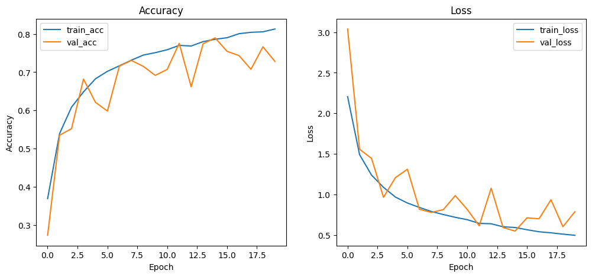
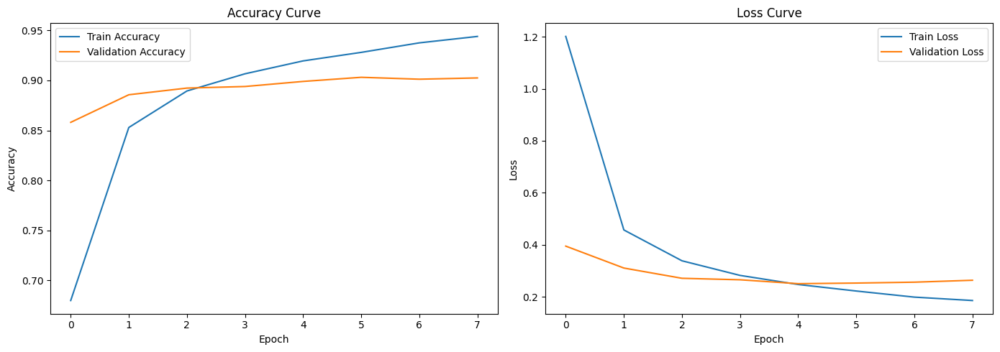
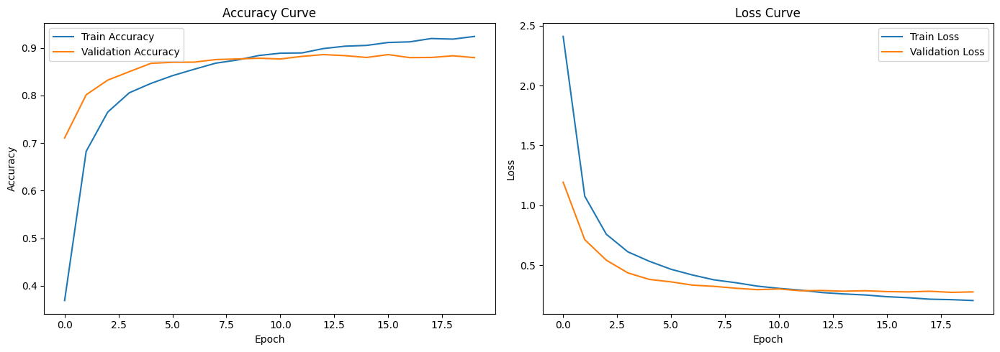
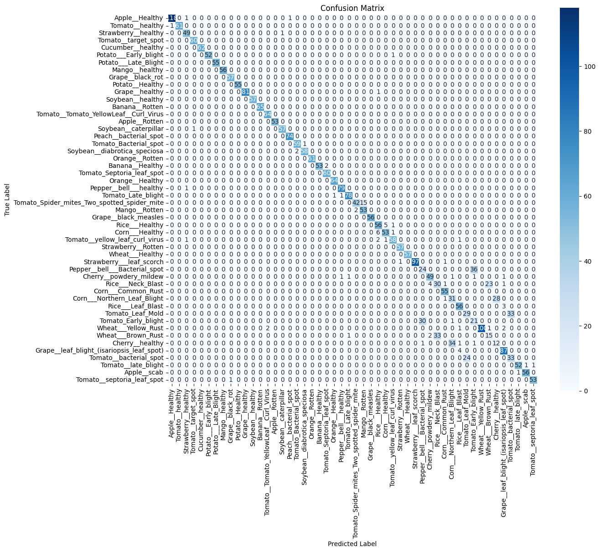

# 🌿 Plant Disease Classification

<div align="center">
  
  <p><small>Sumber gambar: <a href="https://media.springernature.com/lw685/springer-static/image/art%3A10.1038%2Fs41598-023-46218-5/MediaObjects/41598_2023_46218_Fig2_HTML.jpg">Scientific Reports</a></small></p>
</div>

---

## 📌 Deskripsi Proyek

**Plant Disease Classification** adalah aplikasi berbasis *Deep Learning* yang dirancang untuk mengklasifikasikan penyakit tanaman berdasarkan citra daun. Proyek ini memanfaatkan arsitektur *Convolutional Neural Networks (CNN)* serta model *pretrained* seperti **EfficientNetB0** dan **MobileNetV3Small** untuk mengenali berbagai jenis penyakit tanaman secara otomatis.

Aplikasi ini dikembangkan hingga tahap *end-to-end*, mulai dari persiapan dataset, preprocessing, training dan evaluasi model, hingga deployment sederhana menggunakan **Streamlit**.

---

## 🎯 Tujuan

Proyek ini bertujuan untuk:

* Membangun model klasifikasi penyakit tanaman berbasis citra.
* Membandingkan performa beberapa arsitektur Deep Learning (CNN Base, EfficientNetB0, MobileNetV3Small).
* Mengimplementasikan model ke dalam aplikasi web interaktif menggunakan *Streamlit*.

---

## 🚀 Fitur Utama

* Upload gambar daun tanaman (format **JPG / PNG**)
* Prediksi jenis penyakit tanaman beserta *confidence score*
* Visualisasi probabilitas prediksi untuk seluruh kelas
* Mendukung beberapa model klasifikasi (CNN Base, EfficientNetB0, MobileNetV3Small)

---

## ⚙️ Instalasi dan Setup

Aplikasi Project ini dapat diakses secara publik melalui [https://plant-disease-classification-dimas.streamlit.app/](https://plant-disease-classification-dimas.streamlit.app/)

### 1. Clone Repository

```bash
git clone https://github.com/ItsNoru14/Plant-Disease-Classification.git
cd Plant-Disease-Classification
```

### 2. Virtual Environment

Direkomendasikan menggunakan **Python ≥ 3.10**.

```bash
.venv\Scripts\activate
```

### 3. Install Dependencies

```bash
pip install streamlit==1.37.0
pip install tensorflow>=2.20.0
pip install scikit-learn>=1.7.2
pip install joblib>=1.5.3
pip install seaborn>=0.13.2
pip install matplotlib>=3.10.8
```

### 4. Menjalankan Aplikasi Streamlit

Pastikan virtual environment sudah aktif sebelum menjalankan aplikasi.

```bash
streamlit run app.py
```

---

## 📁 Struktur Folder

```bash
Plant-Disease-Classification/
│
├─ data/                  # Dataset citra daun
├─ splits/                # File CSV (train / validation / test)
├─ encoders/              # File label encoder (JSON)
├─ output/                # Hasil visualisasi (accuracy, loss, confusion matrix)
├─ app.py                 # File utama aplikasi Streamlit
```

---

## 📊 Dataset

Dataset yang digunakan berasal dari:

**High Quality Crop Disease Image Dataset**
[https://www.kaggle.com/datasets/akarshangupta/high-quality-crop-disease-image-dataset-for-cnns](https://www.kaggle.com/datasets/akarshangupta/high-quality-crop-disease-image-dataset-for-cnns)

* Total awal: **134 kelas**
* Jumlah gambar: **± 50.000 citra**

---

## 🧹 Persiapan Dataset

Dilakukan proses *filtering dataset* dengan pertimbangan keterbatasan perangkat dan efisiensi training.

Tahapan filtering:

* Memilih kelas dengan jumlah gambar **≥ 100**.
* Dari kelas yang lolos, dipilih **50 kelas dengan jumlah gambar terbanyak**.
* Menyalin gambar ke folder baru `data/dataset_filtered`.
* Menyimpan metadata kelas dan jumlah gambar untuk keperluan *reproducibility*.

Pendekatan ini bertujuan untuk:

* Menjaga stabilitas model
* Mengurangi noise data
* Meningkatkan efisiensi komputasi
* Mempertahankan representativitas dataset

---

## 🔄 Preprocessing

Tahapan preprocessing yang diterapkan:

### 1. Filtering Class

* Menyaring kelas dengan threshold ≥ 100 gambar.
* Memilih 50 kelas teratas berdasarkan jumlah citra.

### 2. Splitting Dataset

* Training: **80%**
* Validation: **10%**
* Testing: **10%**

Output berupa file CSV yang berisi *filepath* dan *label* untuk masing-masing subset.

### 3. Label Encoding

* Label kategori diubah menjadi *integer ID*.
* Mapping label disimpan dalam format **JSON** untuk digunakan saat inferensi di Streamlit.

### 4. Preprocessing Model

**CNN Base (tanpa pretrained):**

* Resize gambar ke `(224 × 224)`
* Normalisasi pixel ke rentang `[0, 1]`
* Konversi dataset menjadi `tf.data.Dataset`

**CNN Pretrained (EfficientNetB0 & MobileNetV3Small):**

* Resize ke `(224 × 224)`
* Penerapan *class weight* untuk menangani ketidakseimbangan kelas
* Dataset menggunakan `tf.data.Dataset`
* EfficientNetB0: `preprocess_input` dari `tensorflow.keras.applications.efficientnet`
* MobileNetV3Small: `preprocess_input` dari `tensorflow.keras.applications.mobilenet_v3`

---

## 🧠 Model yang Digunakan

### 1. CNN Base Light

CNN custom ringan tanpa pretrained weights.

**Karakteristik:**

* Input: `(128, 128, 3)`
* 3 Convolutional Blocks (32 → 64 → 128 filter)
* BatchNormalization + ReLU + MaxPooling
* GlobalAveragePooling2D
* Dense 256 + ReLU + Dropout 0.5

**Tujuan:**
Sebagai baseline model yang ringan, cepat dilatih, dan cocok untuk resource terbatas.

**Hasil Training:**



---

### 2. EfficientNetB0 (Fine-Tuned)

Menggunakan pretrained weights ImageNet dengan fine-tuning 15% layer terakhir.

**Classification Head:**

* BatchNormalization
* Dense 256 + ReLU + L2 Regularization
* Dropout 0.3
* Dense (Softmax)

**Hasil Training:**



---

### 3. MobileNetV3Small (Pretrained)

Model ringan dan efisien untuk deployment.

**Classification Head:**

* Dense 128 + ReLU + Dropout 0.4
* Dense 50 + Softmax

**Hasil Training:**



---

## 📈 Perbandingan Performa Model

| Model            | Accuracy | Precision (Weighted) | Recall (Weighted) | F1-Score (Weighted) |
| ---------------- | -------- | -------------------- | ----------------- | ------------------- |
| CNN Base         | 80.28%   | 0.8113               | 0.8028            | 0.7964              |
| EfficientNetB0   | 89.55%   | 0.8949               | 0.8955            | 0.8943              |
| MobileNetV3Small | 88.47%   | 0.8833               | 0.8847            | 0.8829              |

---

## 📊 Confusion Matrix

**CNN Base**


**EfficientNetB0**


**MobileNetV3Small**


---

## 📝 Analisis Hasil

**CNN Base** memberikan performa baseline yang baik dengan training cepat, namun masih kurang optimal pada kelas dengan sampel kecil.

**EfficientNetB0** menunjukkan performa terbaik secara keseluruhan berkat transfer learning dan fine-tuning, dengan generalisasi yang lebih stabil.

**MobileNetV3Small** menjadi kompromi ideal antara akurasi dan efisiensi, cocok untuk deployment pada perangkat dengan sumber daya terbatas.

Namun kedua model pretrained menunjukkan gejala overfitting, walaupun tidak signifikan hal ini dapat dipengaruhi oleh berbagai faktor, yakni:
- Efek dari fine-tuned yang tidak stabil
- Pola gambar yang terlalu seragam
- Dataset yang tidak stabil

Walaupun hasil dari kedua model Pretrained terlihat bagus, Overfitting tetap terjadi meskipun hanya sedikit.

---

## ✅ Kesimpulan

Proyek ini menunjukkan bahwa penerapan *transfer learning* secara signifikan meningkatkan performa klasifikasi penyakit tanaman berbasis citra. EfficientNetB0 menjadi model terbaik dari sisi akurasi, sementara MobileNetV3Small unggul dari sisi efisiensi komputasi.

Aplikasi Streamlit yang dibangun memungkinkan pengguna melakukan inferensi secara interaktif dan mudah digunakan.
